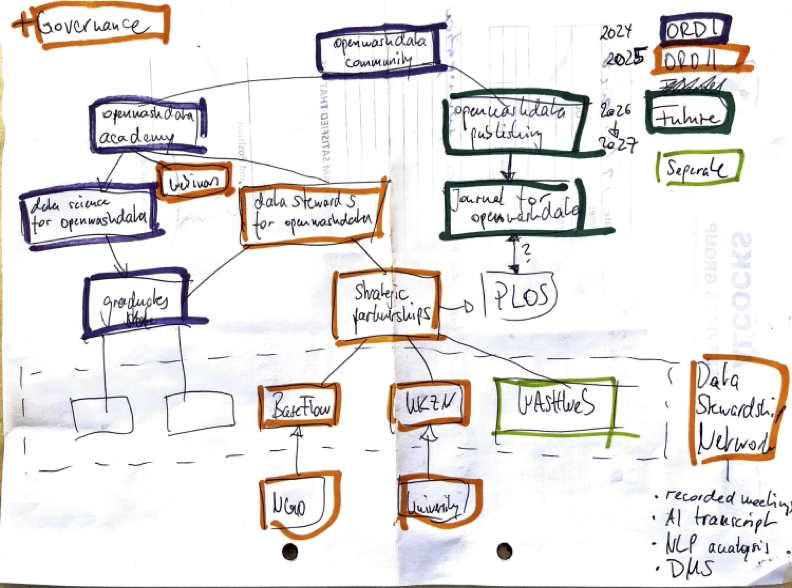

# openwashdata
Lars Schöbitz

# Call Info

## Website

- Measure 1: Calls for Field-Specific Actions
- https://ethrat.ch/en/measure-1-calls-for-field-specific-actions/
- Explore projects will allow early phase exploration, testing and
  prototyping of what an ORD practice could be like. They will enable
  starting to engage with a community without necessarily building up
  something definitive. The aim is to help our researchers to explore if
  ORD practices can be developed and how.

## Aims

Funding for “Explore projects” aims at:

1.  Specifying ORD standards.
2.  Prototyping ORD tools.
3.  Building Communities to engage in ORD practices.
4.  Any other means that help explore and develop ORD practices.

It is important that Explore projects are not self-centred but emphasize
exchanges in the spirit of Open Science with other researchers,
technical experts, and stakeholders.

## Application guidelines (ETH Domain)

- https://ethrat.ch/wp-content/uploads/2023/10/Application-Guidelines_TrackA_Explore_2nd_call_FINAL.pdf
- It is the declared goal to fund proposals that make tools (e.g.,
  software; hardware; protocols; standards; benchmarks; documentation
  and training materials; networking and education events, activities
  and resources) available which enable, facilitate and foster sharing
  research data based on ORD principles. Preference will be given to
  projects which engage and are connected to a community. Therefore,
  applicants are strongly invited to demonstrate why their project
  represents an ORD practice that encourages good research in their
  field.

## Application guidelines (ETHZ & EPFL)

- https://ethrat.ch/wp-content/uploads/2023/10/Application-guidelines-Explore-EPFL-ETHZ-applicants-2nd-call-LATEST.pdf

For applicants at ETHZ

- In this Explore call, applicants at ETHZ must contribute 25% of the
  total budget from the resources of their lab/group/unit, either
  in-cash or in-kind. See the budgeting guidelines below for eligible
  contributions.

For applicants at EPFL

- In this Explore call, applicants at EPFL can be funded for 100% of the
  total budget.

# Project Proposal

Your project proposal must not exceed 12 pages, excluding the
bibliography (A4, Arial 11-point font, 1.5 line-spacing, 2-centimeter
margins). Please address all points below.

# Abstract

**Instructions**

- maax 1500 characters
- needed on submission portal
- will be displayed publicly, see for example:
  https://ethrat.ch/wp-content/uploads/2022/11/ORD_Explore_call1_decisiontable_for-publication.pdf

# Keywords

**Instructions**

- 5 keywords that characterise your proposal (separated by commas)
- needed on submission portal

# Proposal full title

**Instructions**

Please include a project title (max. 12 words); this title will be used
for all correspondence. Proposal Acronym (mandatory)

# Background and motivation

**Instructions**

Please explain which aim(s) of the ORD “contribute projects” you seek to
address:

1.  Specifying ORD standards.
2.  Prototyping ORD tools.
3.  Building Communities to engage in ORD practices.
4.  Any other means that help explore and develop ORD practices.

It is important that Explore projects are not self-centred but emphasize
exchanges in the spirit of Open Science with other researchers,
technical experts, and stakeholders.

## openwashdata community

The openwashdata community has found its home. Thanks to the funding we
received from the first call for Explore projects by the ETH Board, we
have successfully fostered a community of individuals who share a keen
interest in open data and open code within the broader Water,
Sanitation, and Hygiene (WASH) sector.

### Organigram

This proposal is outlined along the figure below which can serve as an
overall organigram of the different openwashdata elements.

### Phase 1

We have established a website for the openwashdata community that
attracts 10 unique visitors daily, disseminate a monthly newsletter that
reaches 200 people, and maintain a community chat with 100 active
members.

We also established the openwashdata academy with our 10-week “data
science for openwashdata” training programme, which has produced 40
graduates.

Lastly, and most importantly, we started “openwashdata publishing” a
clear and efficient data publishing workflow for datasets and code that
follows FAIR principles and highest standards for computational
reproducibility and version control.

We have successfully achieved the objectives of all our work packages in
phase 1. As we transition into the next phase of, our aim is to lay the
groundwork for long-term sustainability of ORD practices in the sector.

### Phase 2

The core of this proposal as we transition into phase 2 openwashdata
community is to extend the established openwashdata academy and further
invest into the openwashdata publishing arm of the community. We will
also setup a governance structure and sounding board to ensure the
long-term sustainability of the community.

## openwashdata academy

Next to the 10-week “data science for openwashdata” training programme,
we will develop a 12-module “data stewardship for openwashdata” training
programme, offered to a newly established data stewardship network.

### data science for openwashdata

With an impressive 222 sign-ups, we launched a 10-week data science
program that has made a significant contribution to the growth of our
community. Each module, lasting 2.5 hours, devoted roughly one-third of
the time to break-out sessions where participants, in groups of two or
three, collaboratively tackled coding assignments. This approach has
fostered a network of individuals who are not only connected but also
share a unified understanding of the data science workflow we advocate
for within the community. We’ve noticed that participants began
collaborating on homework assignments and sharing contact details to
stay connected beyond the course. All graduates have completed and
published a full data science report on GitHub Pages, along with the
corresponding data in a GitHub repository.

We intend to invite the graduates to a newly established data
stewardship network and continue our engagement by offering additional
training in the openwashdata data publishing workflow.

### data stewarship network

We envision a more hands-on approach by embedding a data steward within
two entities. This steward will collaborate with the organization to
identify existing ORD practices, formulate a preliminary data management
strategy, pinpoint datasets ready for open publication, and discern
datasets requiring careful scrutiny before publication due to ethical
approvals, data privacy, or industry partnerships. Our openwashdata team
will provide the steward with comprehensive guidance and technical
support. These partnerships will bolster the reputation of the Global
Health Engineering group at ETH Zurich as a pioneer in open data and
open code within WASH sector. Together with our partners, we aim to
introduce ORD practices (e.g. Data Management Strategy & Data Management
Plans) to the WASH sector.

The two institutions at which the data stewards are employed will be
included as sub-contractors to the proposal. The allocated resources
will fund 50% of the position at each institution. In the context of
this project, sub-contracting these data stewards is absolutely
necessary to ensure that we can actively work with the data stewards at
the institutions to implement ORD practices. These data stewards will be
hired for this task specifically. Further, this effort highlights that
data stewardship should not be done by researchers actively working
within a research group, but by an additional administrative resource
that is dedicated to the task.

In addition to these two core data stewards, we will identify graduates
of our first “data science for openwashdata” course to become part of
the data stewardship network, limiting it to six individuals in total
for the beginning year.

#### UKZN WASH R&D Center

Established in the 1970s, the Water, Sanitation & Hygiene Research &
Development Centre (WASH R&D Centre) at the University of KwaZulu-Natal
in Durban, South Africa, is a transdisciplinary research and development
hub. Formerly known as the Pollution Research Group, the Centre has
become a leader in WASH R&D, providing a platform for testing innovative
sanitation solutions for both local and international service providers
and technology developers. Both, Prof. Elizabeth Tilley and Open Science
Specialist Lars Schöbitz have spent time at the Centre as researchers
between 2011 and 2015, enabling a long lasting relationship built on
trust and mutuality.

One of the Centre’s key initiatives from 2017 to 2023 was the Sanitation
Engineering Field-Testing (EFT) Platform. This platform was designed to
expose sanitation technologies to real-world conditions early in their
development. It achieved this by testing prototypes in informal
settlements and rural households in Durban, South Africa. From 2017 to
2020, nearly 20 prototype technologies were tested on this platform

The platform is a result of a multidisciplinary partnership involving
university partners, local consultancy firm Khanyisa Projects, and the
local eThekwini Municipality’s Water and Sanitation Unit (EWS). On a
national level, the work was supported by the Water Research Commission
(WRC) and financially backed by the Bill & Melinda Gates Foundation
(BMGF). Drawing from the experiences of prototyping various sanitation
technologies, the South African Sanitation Technology Enterprise
Programme (SASTEP) was established. The programme was created by the
Water Research Commission (WRC) in partnership with the Department of
Science and Innovation (DSI), and the Bill & Melinda Gates Foundation
(BMGF), with support from the Department of Water and Sanitation (DWS).
The WASH R&D Centre serves as the research partner for the
implementation of the programme, utilizing the systems established under
the EFT platform.

Over the years, the WASH R&D Centre has amassed a significant amount of
data on WASH related topics, including data from the EFT Platform and
the broader research community. This data is currently stored in various
locations, such as the university’s network drives, the university’s
data repository, the technology developers’ systems and on the personal
computers of researchers, without a holistic data management strategy.
While open access journal publications from the research are available,
the data is not openly published and is not easily accessible to the
research community.

#### BASEflow Malawi

BASEflow, a Malawian social enterprise established in 2017, is dedicated
to enhancing water security in the country. Operating from Blantyre,
this non-profit organization has a committed team of 15 individuals.
They have demonstrated leadership in data collection and sharing within
the Water, Sanitation, and Hygiene (WASH) sector in Malawi, offering
support to research institutions and government agencies in both data
collection and management. During the initial phase of openwashdata,
BASEflow published a dataset using the openwashdata workflow and has
expressed interest in continuing the collaboration to develop a
comprehensive data management strategy. This strategy aims to ensure
that all shareable data is openly published. BASEflow’s commitment to
data transparency is exceptional in the WASH sector, where non-academic
organizations typically have fewer incentives to share their data.
Nevertheless, the data they provide is invaluable and often in high
demand by government entities and researchers. By adopting this open
approach, BASEflow is poised to set a new standard for the sector and
gain recognition as a leader in promoting data openness.

### data stewardship for openwashdata

This training will focus more holistically on data management and
stewardship, including data management plans, data privacy, data ethics,
and data publication. It will cover aspects of file organisation, file
types, and different pathways for collaboration and task management.

We will host modules to identify current file and data management
practices within each organisation and support the definition of a
strategy for (research) data management. Contrary to the “data science
for openwashdata” training, we don’t prescribe one way of doing things
but rather help determine the best practices for the group, allowing
individuals to use the workflows and tools that suit them best to
maintain autonomy, however encouraging best practices for ORD.

The programme will be a monthly offering of 12 modules, each of which
consisting of a 1-hour teaching module, a 1-hour hands-on workshop, and
a 1-hour discussion group exchange.

## Governance

We recognize the necessity of a well-defined governance process and a
feedback mechanism for the project’s long-term success. We propose a
sounding board composed of six members to provide feedback on the
project’s direction. The governance process will outline decision-making
within the community and contribute to the establishment of a
sustainable funding strategy for the openwashdata community

## openwashdata publishing

### Increase FAIRness

The initial phase of our project successfully established a data
publishing workflow that adheres to FAIR data practices and the highest
standards of rigor, transparency, and reproducibility. All work is under
git version control, publicly available on Github, and archived on
Zenodo. This includes the submitted raw data, the code required to
process and prepare the data for analysis, and the code needed to
generate figures and tables for articles on websites created to
publicize and curate the data. We publish the website using the R data
package ecosystem, which provides templates for detailed documentation
and metadata provision for each dataset. Assigning a DOI through Zenodo
and adding all authors through ORCID id ensures the data is findable and
reusable.

In the next phase, we aim to enhance the findability of our data
packages. We plan to identify a list of existing metadata standards and
schemas suitable for further publication, and develop the necessary code
to transform the data package into these standards (e.g., JSON Table
Schema of Frictionless Standards, Dublin Core Metadata Element Set).

While our data is easily accessible to the R community and we continue
to provide CSV and XLSX formats, we recognize that a significant portion
of the scientific community uses Python. Therefore, we will explore ways
to make our datasets more interoperable and accessible to the Python
community by prototyping Python data packages for the pip and conda
package managers.

Currently, our R data packages are installed from Github using the
remotes or devtools R packages. The effort required to submit all
datasets to the Comprehensive R Archive Network (CRAN) is currently too
time-intensive to justify. However, we plan to explore the development
of an R package and its submission to CRAN, which would provide a way to
explore all published datasets and install them through this package.
Publishing an R package on CRAN will significantly enhance the
findability of our data and further streamline the process of exploring
and reusing the data.

Lastly, we will utilize existing tools to assess the FAIRness of our
datasets and use the results to further enhance the FAIRness of our
datasets.

### Journal for openwashdata

Under our publishing arm, we will start to identify the process of
establishing our own journal for openwashdata. This purpose of this
journal is not to highlight scientific results, but to provide a
platform for data publishing. Our initial vision is to host this journal
entirely through GitHub, using Quarto documents as a submission format,
from which we can generate attractive online journal publication. The
first issue of this journal will include the capstone project reports of
graduates from our “data science for openwashdata” course offer.
Further, we will use the R data packages created through our data
publishing workflow as a submission format.

# ORD project plan

**Instructions**

Please describe your project design, including how it addresses the
aim(s) of the ORD “Explore projects” described above. Please refer to
the scientific literature as well as any preliminary, unpublished
results that have informed your approach.

- Which specific gap(s) in knowledge will your work address? Why is your
  approach innovative?
- What questions will the project answer? What specific outcomes will
  you focus on?
- Which strategy will you use to address the questions you seek to
  answer?

## WP1: Data stewardship network

### Goal

The goal of WP1 is to establish and strengthen strategic partnerships
with key institutions and organizations in the WASH sector to promote
ORD practices and enhance the impact of the openwashdata community.

### Activities

1.  Activity 1.1: Identify and engage potential partner organizations
    for collaboration.
2.  Activity 1.2: Develop and implement data stewardship training
    program with network.

### Research Questions

1.  RQ 1.1: What are the key factors for successful strategic
    partnerships in promoting ORD practices?
2.  RQ 1.2: How does the integration of data stewards within
    organizations affect the adoption of ORD practices?

### Aims addressed

This WP addresses the aim of building communities to engage in ORD
practices by fostering collaborations that emphasize exchanges in the
spirit of Open Science with other researchers, technical experts, and
stakeholders. It further addresses specific knowledge gaps around
ethical approval in different countries, for different organisations
(NGO & University) and for different types of data (qualitative,
quantitative, observational, experimental, etc.) (REFERENCE). Our
strategy is to establish a cohort of data stewards organised through
implementing agile project management practices (bi-weekly sprint
meetings, quarterly strategy meetings, etc.). This will enable us to
quickly respond to the needs of the community and develop a strong
network of data stewards that can support each other and the community.

## WP2: Governance

### Goal

The goal of WP2 is to establish a robust governance framework that
ensures the sustainability and integrity of the openwashdata community
and its initiatives.

### Activities

1.  Activity 2.1: Develop a governance structure for a community
    organization and decision-making processes.
2.  Activity 2.2: Form a sounding board comprising community members to
    provide directional feedback.
3.  Activity 2.3: Create a long-term funding strategy for the
    openwashdata community.

### Research Questions

1.  RQ 2.1: What governance structures best support the sustainability
    of ORD communities?
2.  RQ 2.2: How does community feedback influence the direction and
    effectiveness of ORD initiatives?
3.  RQ 2.3: What are the key elements of a successful long-term funding
    strategy for ORD initiatives?

### Aims addressed

This WP contributes to the aim of building communities by establishing a
governance process that involves the community in decision-making and
strategic planning.

## WP3: Community building

### Goal

The goal of WP3 is to expand and strengthen the openwashdata community
through targeted engagement and capacity-building activities.

### Activities

1.  Activity 3.1: Offer advanced data science training and workshops to
    community members.
2.  Activity 3.2: Develop a mentorship program to support new members in
    adopting ORD practices.
3.  Activity 3.3: Organize community events to foster networking and
    collaboration.

### Research Questions

1.  RQ 3.1: What are the most effective methods for building and
    maintaining an active ORD community?
2.  RQ 3.2: How does mentorship contribute to the adoption of ORD
    practices among community members?
3.  RQ 3.3: What role do community events play in promoting
    collaboration and knowledge exchange?

### Aims addressed

This WP aligns with the aim of building communities to engage in ORD
practices by providing training, mentorship, and networking
opportunities that support community growth and engagement. Our strategy
is to further engage with the cohort of students and graduates of our
first ORD training course (data science for openwashdata). They will
become advocates for the already established openwashdata data
publishing workflow and become mentors in onboarding new community
members.

## WP4: Increase FAIRness

### Goal

The goal of WP4 is to enhance the Findability, Accessibility,
Interoperability, and Reusability (FAIR) of data produced by the
openwashdata community.

### Activities

1.  Activity 4.1: Develop and submit an R package to CRAN for easier
    data exploration and installation.
2.  Activity 4.2: Assess and improve the FAIRness of datasets using
    existing tools.
3.  Activity 4.3: Prototype Python data packages for increased
    interoperability with the Python community.

### Research Questions

1.  RQ 4.1: How does the availability of an R package on CRAN affect the
    findability and reuse of datasets?
2.  RQ 4.2: What improvements in FAIRness metrics can be achieved
    through targeted interventions?
3.  RQ 4.3: What are the challenges and benefits of creating
    cross-platform data packages for R and Python users?

### Aims addressed

This WP addresses the aims of specifying ORD standards and prototyping
ORD tools by creating accessible data packages and improving the
FAIRness of datasets, thus facilitating and fostering sharing research
data based on ORD principles.

## WP5: Journal for openwashdata

### Goal

The goal of this work package is to identify the process of establishing
a journal that highlights data as a the product of (academic) work.

### Activities

1.  
2.  

### Research Questions

1.  RQ 4.1: How does the availability of an R package on CRAN affect the
    findability and reuse of datasets?
2.  RQ 4.1: How does the availability of an R package on CRAN affect the
    findability and reuse of datasets?

### Aims addressed

This WP addresses the aims of specifying ORD standards and prototyping
ORD tools by creating accessible data packages and improving the
FAIRness of datasets, thus facilitating and fostering sharing research
data based on ORD principles.

# Impact (TODO)

**Instructions**

Please address these specific points:

- How sustainable is the proposed project inside the ETH Domain?

- To what extent will the planned project substantially advance the ORD
  field, or solve a critical outstanding problem in the targeted
  field(s)?

- To what extent does the proposal support a collaborative approach,
  involving significant synergies, complementarities, or/and scientific
  added-value to achieve its objectives?

# Work Packages and milestones

**Instructions**

Please include a detailed Gantt chart or table outlining the timeline of
your project, including key activities and major deliverables.

------------------------------------------------------------------------

The following Table X shows a basic gantt chart against the four work
packages, including program activities. Column “Lead” abbreviations:

“Any publications derived from this program will be published as open
access material, following ORD practices and Open Science standards for
computational reproducibility and sharing of data and code under FAIR
principles.”

Table X:
https://docs.google.com/spreadsheets/d/1KbxWuLBKi2mEWWeE935yR5bqoZskq6Joe-6-PviqXsY/edit#gid=0

# Resources (including project costs)

Table Y:
https://docs.google.com/spreadsheets/d/1jl2yIyX7-xsnawdO26IlJY5hcOhD0Bzg9j7yt3p47uc/edit?usp=drive_web&ouid=106935258332658829405

# Budget justification and description of co-financing

Table Z:
https://docs.google.com/spreadsheets/d/1DHb4j8t1yhV1AyFqCY0ZkpAUwDQT2JArBAeXgiWUmNM/edit#gid=0

# Bibliography
